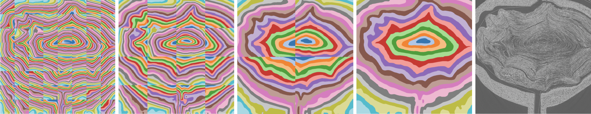
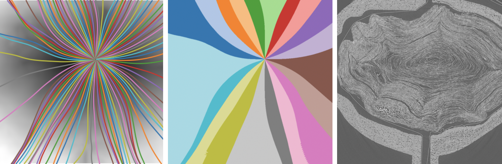

# Introduction

This repository is built and modified on top of [Evolutor](https://github.com/KhartesViewer/evolutor), which takes a 2D scroll slice as input and produces an undeformed version of the slice as output.

This repository is divided into two parts: one involves data processing, located in the Python scripts in the root directory, and the other part focuses on data visualization, located in the JavaScript in the `visualize` folder.

In the data processing section, I’ve extended the idea of Evolutor, but divided the process into multiple smaller chunks for independent and parallel computations, which are then merged into a complete result at the end.

In the visualization section, you can interact with the processed data to compare the deformation differences.

## Generate Ome-Zarr for 2D scroll slice

Khartes wrote a script called [scroll_to_ome.py](https://github.com/KhartesViewer/scroll2zarr/blob/main/scroll_to_ome.py), which can generate Ome-Zarr format for a TIFF stack image. I made some small modifications to allow it to generate Ome-Zarr data for a single image. Take scroll1 `02000.tif` as an example.

Please create a new folder named `evol1` in the root directory and place `02000.tif` inside. The following command will generate the corresponding `scroll.zarr` data.
```python
python scroll_to_ome.py ./evol1/02000.tif ./evol1/scroll.zarr
```

## Generate UV coordinates

More details later.

## Result

This approach greatly speeds up the matrix solving process—calculations can be done in a few seconds. Currently, the implementation works on 2D images, but I believe the benefits of chunking and merging will be even greater for 3D data.

The image below shows the local computation of radius (8×8 chunks) and the gradual merging of the results (from left to right). Interestingly, I don’t need to provide scroll umbilicus coordinates; the merging process can automatically find out the global minimum.



Although this approach works for radius, the decomposition and merging in the theta direction haven’t been successful so far, which is something I might explore further in the future.

However, I’ve found another way to quickly and roughly generate theta coordinates: by using the guidance of the structure tensor. Centered at the scroll umbilicus, shoot 100 rays outward at different angles and use interpolation to estimate the angular information in the rest of the areas.



## Visualization

I believe the deformation process is important because it allows us to more continuously track and compare the before-and-after states. So, I developed a visualization application (in `visualize` folder) that lets you intuitively follow the entire process.

More details later.


